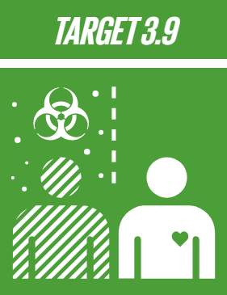
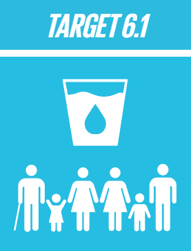
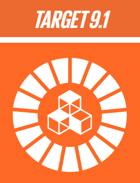
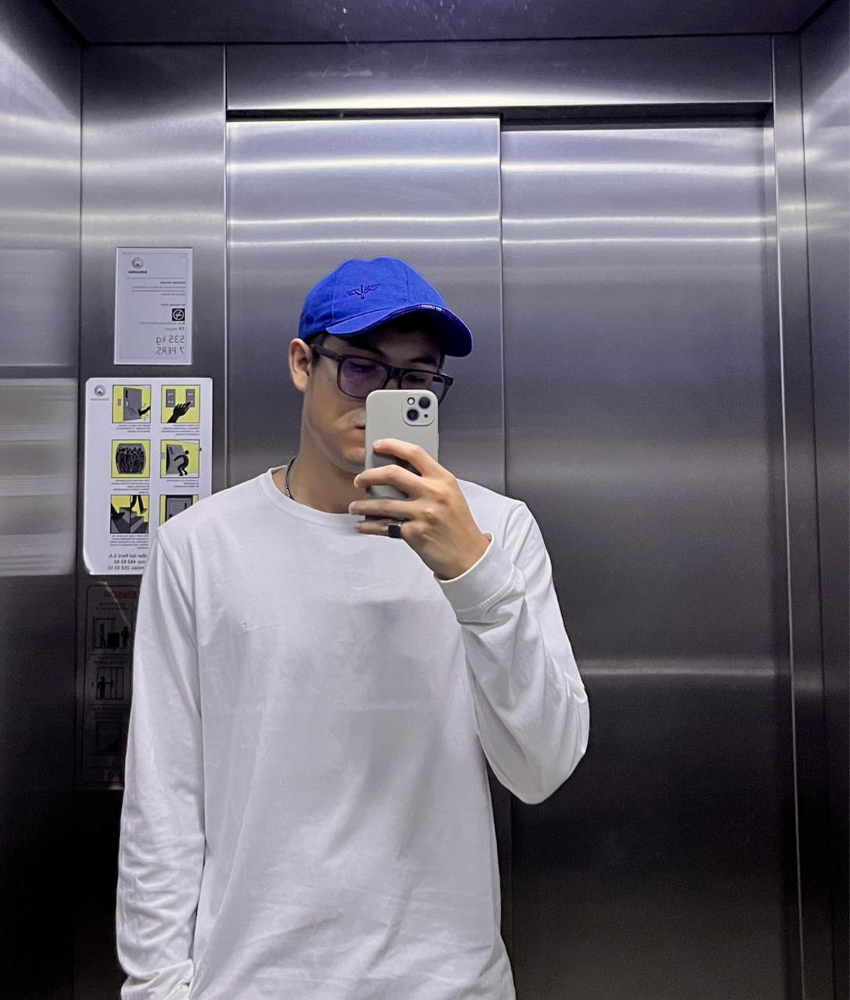
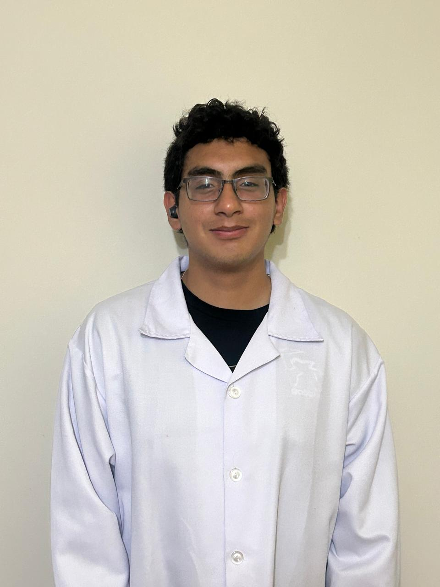
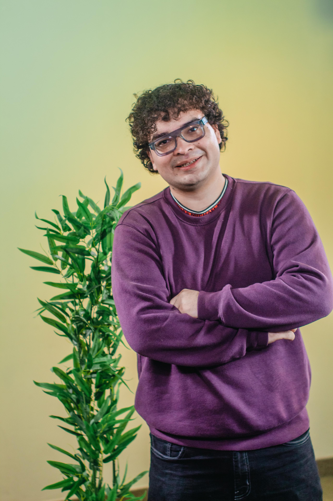
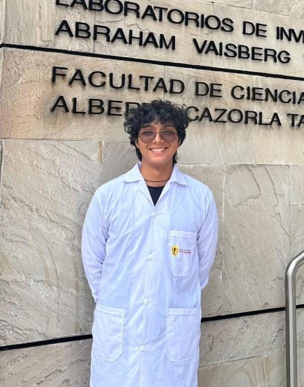

# Equipo 02 - Proyectos de Ingeniería
Carrera de Ingeniería Ambiental 
Universidad Peruana Cayetano Heredia

## 🌍 Descripción del Equipo
Somos el Equipo 02 del curso Proyectos de Ingeniería 2026-1, conformado por estudiantes de la carrera de Ingeniería Ambiental.
Nuestro objetivo es aplicar la metodología de diseño para generar soluciones innovadoras con impacto social, tecnológico y ambiental.

## 🎯 Alineación con los Objetivos de Desarrollo Sostenible (ODS)

El proyecto **AquaBalde** se fundamenta en la Agenda 2030, integrando soluciones tecnológicas para abordar desafíos críticos en salud y saneamiento. Nuestras metas específicas son:

### 🏥 ODS 3: Salud y Bienestar
> **Meta 3.9:** Reducir considerablemente el número de muertes y enfermedades causadas por productos químicos peligrosos y la contaminación del aire, el agua y el suelo.

* **Aplicación:** El sistema previene enfermedades de transmisión hídrica mediante un diagnóstico preventivo en tiempo real, alertando al usuario antes de la ingesta de agua contaminada.

    <td></td>

### 💧 ODS 6: Agua Limpia y Saneamiento
> **Meta 6.1:** Lograr el acceso universal y equitativo al agua potable a un precio asequible para todos.

* **Aplicación:** Democratizamos el monitoreo de calidad de agua. Al reducir el costo operativo frente a equipos industriales, permitimos que comunidades rurales tengan una herramienta de vigilancia asequible y técnica.

    <td></td>

### 🏗️ ODS 9: Industria, Innovación e Infraestructura
> **Meta 9.1:** Desarrollar infraestructuras fiables, sostenibles, resilientes y de calidad para apoyar el desarrollo económico y el bienestar humano.

* **Aplicación:** Convertimos un recipiente de almacenamiento tradicional en una infraestructura digital inteligente (IoT), fortaleciendo la resiliencia tecnológica en zonas con acceso limitado a servicios básicos.

    <td></td>

---

<h2>👥 Integrantes del Equipo</h2>

<table>
  <tr>
    <th>Foto</th>
    <th>Nombre</th>
    <th>Rol</th>
    <th>Intereses</th>
  </tr>

  <tr>
    <td></td>
    <td>Nicolás Genaro Chuqista Rivadeneira</td>
    <td> Líder General y de Diseño </td>
    <td>Innovación social, sostenibilidad</td>
  </tr>

  <tr>
    <td></td>
    <td>Tomás del Castillo Mogollón</td>
    <td> Líder de Tecnología </td>
    <td>Gestión ambiental, Bioremediación</td>
  </tr>

  <tr>
    <td></td>
    <td>Raúl Enrique Jauregui Penny</td>
    <td> Líder ESG </td>
    <td>Bioeconomía, Gestión de Proyecto</td>
  </tr>

  <tr>
    <td></td>
    <td>Flavio Francisco Rabanal Bravo</td>
    <td> Líder de investigación y operaciones </td>
    <td>Economía Circular, Biotecnología</td>
  </tr>

</table>

</body>
</html>
